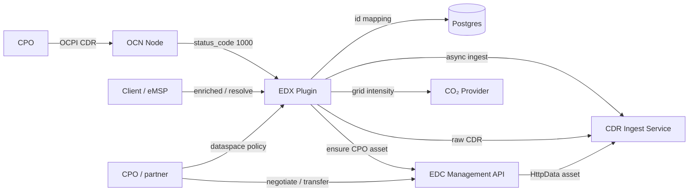
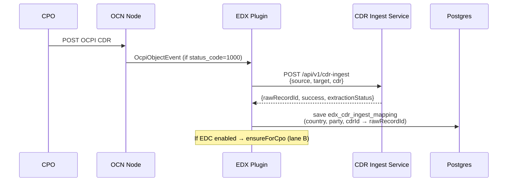
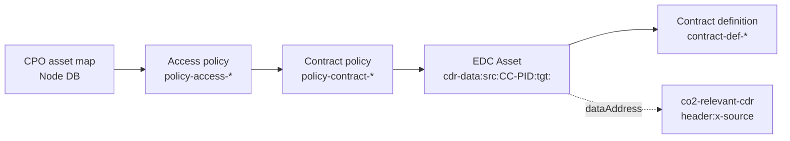
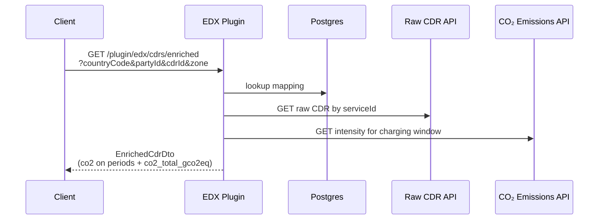
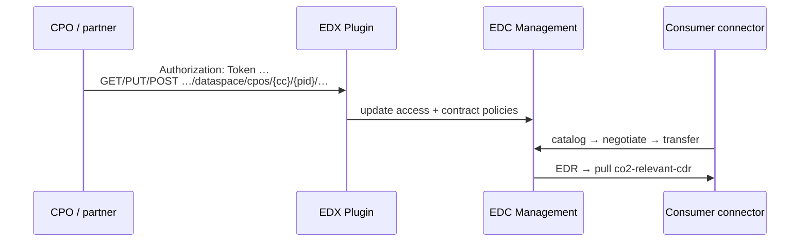

# Architecture

How the EDX plugin sits on the OCN Node: CDR ingest, optional EDC asset provisioning, CO₂ enrichment, and dataspace policy APIs.

Path prefix below uses the node default `ocn.node.apiPrefix=ocn-v2` → `/ocn-v2/plugin/edx/...`.

## Overview



## A · CDR write

Triggered when an OCPI CDR write succeeds (`status_code = 1000`).



| Field | Source |
|-------|--------|
| `source` | CDR body `country_code` + `party_id` (e.g. `DE-CPO`) |
| `target` | OCPI event to-party (`toCountryCode` + `toPartyId`) |
| Mapping saved | Whenever `rawRecordId` is present (even if `success=false`) |

## B · EDC provision (per CPO, first ingest)

Runs once per CPO when `edx.edc.management.enabled=true`. Idempotent (HTTP 409 = already exists).



### ID scheme (example CPO `DE` / `CPO`)

| Resource | Id |
|----------|----|
| `sourceKey` | `DE-CPO` |
| `assetId` | `cdr-data:src:DE-CPO:tgt:` |
| Access policy | `policy-access-DE-CPO` |
| Contract policy | `policy-contract-DE-CPO` |
| Contract definition | `contract-def-DE-CPO` |

### Asset `dataAddress`

```json
{
  "type": "HttpData",
  "baseUrl": "https://your-cdr-service.example.com/api/v1/co2-relevant-cdr",
  "authKey": "x-api-key",
  "authCode": "<cdr-service-api-key>",
  "proxyBody": "true",
  "proxyPath": "true",
  "proxyMethod": "true",
  "proxyQueryParams": "true",
  "header:x-source": "DE-CPO"
}
```

Empty `x-target` is omitted (not sent as `""`).

### Policy consumers

Both access and contract policies share the same consumer list:

| Consumer `type` | ODRL leftOperand |
|-----------------|------------------|
| `DID` | `identity` |
| `MARKET_PARTNER` | `MarketPartner.mpId` |

Initial consumers come from `edx.edc.asset.defaultConsumersJson`. Later updates go through the dataspace API (lane D).

## C · Enrich read



Related read endpoints (no auth):

| Method | Path | Purpose |
|--------|------|---------|
| `GET` | `/plugin/edx/cdrs/mapping` | OCPI identity → `serviceId` |
| `GET` | `/plugin/edx/cdrs/mapping/by-service-id/{serviceId}` | Reverse lookup |
| `GET` | `/plugin/edx/cdrs/resolve` | Raw CDR via mapping |
| `GET` | `/plugin/edx/cdrs/raw/{serviceId}` | Raw CDR by ingest id |
| `GET` | `/plugin/edx/cdrs/enriched` | CO₂-enriched CDR |
| `GET` | `/plugin/edx/co2` | Grid intensity proxy |

## D · Policy & dataspace



| Method | Path | Auth | Behavior |
|--------|------|------|----------|
| `GET` | `/plugin/edx/dataspace/cpos/{cc}/{pid}` | CPO Token C | Asset / policy ids + consumers |
| `PUT` | `…/policy` | CPO Token C | Replace full consumer list |
| `POST` | `…/policy/consumers` | CPO Token C | Append consumers (deduped) |

Auth: `Authorization: Token <base64(plain Token C)>`. The platform must own a CPO role for `{countryCode}/{partyId}`.

## Persistence

| Table | Key | Purpose |
|-------|-----|---------|
| `edx_cdr_ingest_mapping` | `(country_code, party_id, cdr_id)` | OCPI id → CDR service `rawRecordId` |
| `edx_cpo_asset_mapping` | `(country_code, party_id)` | CPO → EDC ids + `allowedConsumersJson` |

## Configuration gates

| Feature | Required config |
|---------|-----------------|
| Plugin load | `edx.cdr.service.baseUrl` |
| EDC provision + dataspace APIs | `edx.edc.management.enabled=true` + `baseUrl` |
| Enrich + CO₂ proxy | `edx.co2.provider.publicApiUrl` + `token` |

Full property list: [../README.md](../README.md).
